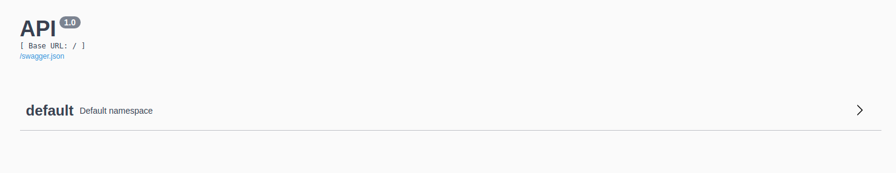

# Hello world API

This is a simple example of how to deploy python api using app engine standard.

## Deploy command

First you need to have Cloud SDK installed on your machine. After that, login to your GCP account and then deploy by using this command.

```bash
gcloud app deploy
```

You can use this command to open deployed api: `gcloud app browse -s hello-flask-restx` and you will see something like this:



In this sample i'm using `Flask RestX` which uses OpenAPI standard to self-document Rest APIS. For more information check [here](https://flask-restx.readthedocs.io/en/latest/)